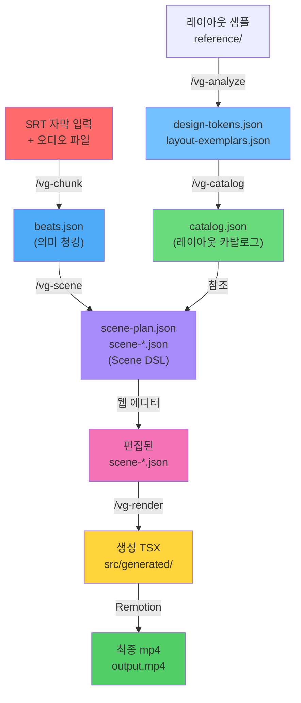

# 아키텍처 상세 설계

## 개요

newVideoGen은 4층 파이프라인 + 5개 Claude Code 스킬 + 8개 루트 레이아웃 패밀리로 구성된 복잡한 시스템입니다. 이 문서에서는 전체 아키텍처, 데이터 흐름, 각 컴포넌트의 책임을 상세히 정의합니다.

---

## 🏗️ 4층 파이프라인 아키텍처

```
입력: SRT 자막 + 오디오
  ↓
┌─────────────────────────────────────────────┐
│  Layer A: 의미 청킹 층                       │
│  SRT → 의미 역할 추출, 비트 분해             │
│  담당: /vg-chunk 스킬                        │
│  출력: beats.json                           │
└─────────────────────────────────────────────┘
  ↓
┌─────────────────────────────────────────────┐
│  Layer B: 장면 구조 정의 층                   │
│  beats.json + 레이아웃 카탈로그 → DSL 생성   │
│  담당: /vg-scene 스킬                        │
│  출력: scene-plan.json + scene-*.json        │
└─────────────────────────────────────────────┘
  ↓
┌─────────────────────────────────────────────┐
│  Layer C: 스택 레이아웃 엔진                  │
│  DSL → 중첩 스택 좌표 계산                   │
│  담당: Remotion 렌더러 (내부)                │
│  출력: 픽셀 좌표 + z-index                  │
└─────────────────────────────────────────────┘
  ↓
┌─────────────────────────────────────────────┐
│  Layer D: 렌더/애니메이션 층                 │
│  TSX 컴포넌트 → 최종 mp4                    │
│  담당: /vg-render 스킬 + Remotion            │
│  출력: output.mp4                           │
└─────────────────────────────────────────────┘
  ↓
출력: mp4 파일 (또는 타임라인 에디터로 편집)
```

---

## 🎯 5개 Claude Code 스킬 상세

### 1. `/vg-analyze` (기반, 1회성)

**담당**: 3D 엔진 스페셜리스트
**실행 시점**: 프로젝트 초기화 시 1회

**입력**:
```
reference/
├── hero-center-1.png
├── hero-center-2.png
├── split-2col-1.png
├── ... (총 30+ 레이아웃 샘플)
└── metadata.json (각 이미지별 레이아웃 타입 라벨)
```

**처리 로직**:
1. 각 이미지의 시각적 특징 추출 (위치, 색상, 타이포그래피)
2. 반복되는 패턴 분류 (8개 루트 레이아웃 패밀리 식별)
3. 디자인 토큰 추출 (색상, 폰트, 간격)

**출력**:
```json
{
  "design-tokens.json": {
    "colors": {
      "primary": "#00FF00",
      "background": "#000000",
      "text": "#FFFFFF",
      "accent1": "#FF0080",
      "accent2": "#00FFFF"
    },
    "typography": {
      "headlineFont": "Inter",
      "headlineSize": 64,
      "bodyFont": "Inter",
      "bodySize": 24
    },
    "spacing": {
      "gutter": 16,
      "sectionPadding": 48,
      "cardGap": 24
    },
    "radii": {
      "default": 8,
      "large": 16
    }
  },
  "layout-exemplars.json": {
    "layouts": [
      {
        "id": "hero-center",
        "name": "대형 숫자/텍스트 중앙 배치",
        "visualCharacteristics": {
          "alignment": "center",
          "mainElement": "large-headline",
          "supportingElements": ["kicker", "supporting-text"]
        },
        "useCases": ["assertion", "statistic"],
        "sampleImages": ["hero-center-1.png", "hero-center-2.png"]
      },
      ...
    ]
  }
}
```

---

### 2. `/vg-catalog` (기반, 1회성)

**담당**: 백엔드 스페셜리스트
**실행 시점**: `/vg-analyze` 완료 후 1회

**입력**:
- `layout-exemplars.json`
- `design-tokens.json`

**처리 로직**:
1. 8개 레이아웃 패밀리별 특성 정의
2. 각 레이아웃의 권장 intent/tone 매핑
3. Scene DSL 스키마 생성
4. 모션 프리셋 카탈로그 생성

**출력**:
```json
{
  "catalog": {
    "layoutFamilies": [
      {
        "id": "hero-center",
        "name": "대형 숫자/텍스트 중앙 배치",
        "description": "한 가지 큰 데이터 포인트나 주요 메시지를 강조할 때 사용",
        "components": [
          { "id": "kicker", "type": "Kicker", "optional": false },
          { "id": "headline", "type": "Headline", "optional": false },
          { "id": "supporting", "type": "SupportingText", "optional": true },
          { "id": "background", "type": "Background", "optional": true }
        ],
        "recommendedFor": {
          "intents": ["assertion"],
          "tones": ["emphasis"],
          "evidenceTypes": ["statistic"]
        },
        "motionPresets": ["fadeUp", "popNumber", "countUp"],
        "dimensions": {
          "width": 1920,
          "height": 1080,
          "aspectRatio": 16 / 9
        }
      },
      {
        "id": "split-2col",
        "name": "2열 비교 레이아웃",
        "description": "두 가지 개념을 나란히 비교할 때 사용",
        "components": [
          { "id": "left-content", "type": "Column", "optional": false },
          { "id": "right-content", "type": "Column", "optional": false },
          { "id": "divider", "type": "Divider", "optional": true }
        ],
        "recommendedFor": {
          "intents": ["comparison"],
          "tones": ["neutral", "emphasis"],
          "evidenceTypes": ["statistic", "visualization"]
        },
        "motionPresets": ["slideSplit", "fadeUp", "popBadge"]
      },
      {
        "id": "grid-4x3",
        "name": "그리드 레이아웃",
        "description": "여러 항목을 격자 형태로 표현",
        "components": [
          { "id": "grid", "type": "Grid", "optional": false },
          { "id": "items", "type": "GridItem[]", "optional": false }
        ],
        "recommendedFor": {
          "intents": ["list", "process"],
          "tones": ["neutral", "emphasis"],
          "evidenceTypes": ["visualization", "process"]
        },
        "motionPresets": ["staggerChildren", "fadeUp", "popBadge"]
      },
      {
        "id": "process-horizontal",
        "name": "수평 프로세스 플로우",
        "description": "순차적 프로세스나 타임라인 표현",
        "components": [
          { "id": "process-items", "type": "ProcessItem[]", "optional": false },
          { "id": "connectors", "type": "ConnectorArrow[]", "optional": true }
        ],
        "recommendedFor": {
          "intents": ["process", "comparison"],
          "tones": ["neutral"],
          "evidenceTypes": ["process", "visualization"]
        },
        "motionPresets": ["drawConnector", "staggerChildren", "fadeUp"]
      },
      {
        "id": "radial-focus",
        "name": "원형 차트/프로그레스 링 중심",
        "description": "진행률이나 비율을 강조",
        "components": [
          { "id": "radial-chart", "type": "RadialChart", "optional": false },
          { "id": "center-value", "type": "Headline", "optional": true },
          { "id": "legend", "type": "Legend", "optional": true }
        ],
        "recommendedFor": {
          "intents": ["assertion"],
          "tones": ["emphasis"],
          "evidenceTypes": ["statistic", "visualization"]
        },
        "motionPresets": ["pulseAccent", "countUp", "popNumber"]
      },
      {
        "id": "stacked-vertical",
        "name": "세로 타임라인/스텝",
        "description": "순차적 단계나 타임라인 표현",
        "components": [
          { "id": "items", "type": "StackItem[]", "optional": false },
          { "id": "connector", "type": "VerticalLine", "optional": true }
        ],
        "recommendedFor": {
          "intents": ["process"],
          "tones": ["neutral", "emphasis"],
          "evidenceTypes": ["process", "visualization"]
        },
        "motionPresets": ["staggerChildren", "fadeUp", "popBadge"]
      },
      {
        "id": "comparison-bars",
        "name": "수평 바 차트 비교",
        "description": "수치 비교나 성과 지표 표현",
        "components": [
          { "id": "bars", "type": "BarItem[]", "optional": false },
          { "id": "labels", "type": "Label[]", "optional": true },
          { "id": "values", "type": "Value[]", "optional": true }
        ],
        "recommendedFor": {
          "intents": ["comparison", "assertion"],
          "tones": ["emphasis", "neutral"],
          "evidenceTypes": ["statistic", "visualization"]
        },
        "motionPresets": ["wipeBar", "countUp", "popNumber"]
      },
      {
        "id": "spotlight-case",
        "name": "사례/제품 스포트라이트",
        "description": "특정 사례나 제품을 강조 표현",
        "components": [
          { "id": "image", "type": "Image", "optional": false },
          { "id": "title", "type": "Headline", "optional": false },
          { "id": "description", "type": "SupportingText", "optional": true },
          { "id": "cta", "type": "Badge", "optional": true }
        ],
        "recommendedFor": {
          "intents": ["case-study", "assertion"],
          "tones": ["emphasis", "neutral"],
          "evidenceTypes": ["statistic", "visualization", "quotation"]
        },
        "motionPresets": ["fadeUp", "revealMask", "popBadge"]
      }
    ],
    "motionPresets": {
      "fadeUp": {
        "type": "fade",
        "direction": "up",
        "durationFrames": 30,
        "easing": "easeInOutQuad"
      },
      "popNumber": {
        "type": "scale",
        "startScale": 0.5,
        "endScale": 1,
        "durationFrames": 40,
        "easing": "easeOutBounce"
      },
      "staggerChildren": {
        "type": "stagger",
        "delayBetweenFrames": 10,
        "easing": "easeInOutQuad"
      },
      "drawConnector": {
        "type": "draw",
        "direction": "horizontal",
        "durationFrames": 30,
        "easing": "easeInOutQuad"
      },
      "pulseAccent": {
        "type": "pulse",
        "scaleRange": [1, 1.1],
        "durationFrames": 20,
        "repeat": true
      },
      "wipeBar": {
        "type": "wipe",
        "direction": "right",
        "durationFrames": 40,
        "easing": "easeInOutQuad"
      },
      "countUp": {
        "type": "count",
        "startValue": 0,
        "durationFrames": 60,
        "easing": "easeInOutQuad"
      },
      "slideSplit": {
        "type": "slide",
        "direction": "both",
        "durationFrames": 30,
        "easing": "easeInOutQuad"
      },
      "revealMask": {
        "type": "mask",
        "direction": "both",
        "durationFrames": 40,
        "easing": "easeInOutQuad"
      },
      "popBadge": {
        "type": "scale+fade",
        "startScale": 0,
        "endScale": 1,
        "durationFrames": 25,
        "easing": "easeOutBounce"
      }
    }
  },
  "sceneDslSchema": {
    "version": "1.0.0",
    "jsonSchema": { /* 자세한 JSON Schema */ }
  }
}
```

---

### 3. `/vg-chunk` (영상별)

**담당**: 백엔드 스페셜리스트
**실행 시점**: 각 영상 처리 시

**입력**:
```srt
1
00:00:00,000 --> 00:00:05,000
AI가 콘텐츠를 변화시키고 있습니다

2
00:00:05,000 --> 00:00:10,000
세 가지 주요 트렌드를 살펴보겠습니다
```

**처리 로직** (Claude API 이용):
1. 각 자막 구간의 의미 분석
   - **intent**: 주장(assertion) / 비교(comparison) / 사례(case-study) / 경고(warning) / 과정(process) / 요약(summary)
   - **tone**: 강조(emphasis) / 설명(explanation) / 증명(proof) / 반전(twist) / 중립(neutral)
   - **evidenceType**: 통계(statistic) / 인용(quotation) / 시각화(visualization) / 프로세스(process)
   - **emphasisTokens**: 강조할 키워드 배열
   - **density**: 정보 밀도 (low/medium/high)
   - **beatCount**: 애니메이션 비트 수

**출력** (beats.json):
```json
{
  "filename": "video-001.srt",
  "audioFile": "video-001.mp3",
  "totalDurationMs": 300000,
  "beats": [
    {
      "beatIndex": 0,
      "timeStart": "00:00:00,000",
      "timeEnd": "00:00:05,000",
      "frameStart": 0,
      "frameEnd": 150,
      "text": "AI가 콘텐츠를 변화시키고 있습니다",
      "intent": "assertion",
      "tone": "emphasis",
      "evidenceType": "statistic",
      "emphasisTokens": ["AI", "변화"],
      "density": "high",
      "beatCount": 2
    },
    {
      "beatIndex": 1,
      "timeStart": "00:00:05,000",
      "timeEnd": "00:00:10,000",
      "frameStart": 150,
      "frameEnd": 300,
      "text": "세 가지 주요 트렌드를 살펴보겠습니다",
      "intent": "process",
      "tone": "neutral",
      "evidenceType": "process",
      "emphasisTokens": ["세 가지", "트렌드"],
      "density": "medium",
      "beatCount": 1
    }
  ]
}
```

---

### 4. `/vg-scene` (영상별)

**담당**: 백엔드 스페셜리스트
**실행 시점**: `/vg-chunk` 완료 후

**입력**:
- `beats.json`
- `catalog.json`
- `design-tokens.json`

**처리 로직**:

1. **점수 계산 시스템**:
   ```
   최종 점수 = 의미적합도(40)
             + 증거타입적합도(20)
             + 리듬적합도(15)
             + 자산보유(10)
             - 최근중복패널티(25)
             - 직전유사도(20)
   ```

2. **의미적합도(40점)**: 레이아웃의 intent 권장도와 비교
   ```
   if beat.intent in layout.recommendedFor.intents:
     score += 40
   else if beat.intent in layout.relatedIntents:
     score += 20
   else:
     score += 5
   ```

3. **증거타입적합도(20점)**: 시각화 유형과의 매칭
   ```
   if beat.evidenceType matches layout.visualizationType:
     score += 20
   else:
     score += 5
   ```

4. **리듬적합도(15점)**: beatCount와 레이아웃 복잡도
   ```
   if beat.beatCount matches layout.complexity:
     score += 15
   else:
     score += 5
   ```

5. **자산보유(10점)**: 브랜드 로고/아이콘 가용성
   ```
   for keyword in beat.emphasisTokens:
     if assetLibrary.hasLogo(keyword):
       score += 10
   ```

6. **최근중복패널티(-25점)**: 최근 5개 장면에서 같은 레이아웃 사용
   ```
   if layoutFamily in recentScenes[-5:]:
     score -= 25
   ```

7. **직전유사도패널티(-20점)**: 직전 장면과 유사도 계산
   ```
   similarity = cosineSimilarity(beat, previousBeat)
   if similarity > 0.7:
     score -= 20
   ```

**출력** (scene-plan.json + scene-*.json):
```json
{
  "projectId": "video-001",
  "filename": "video-001.srt",
  "totalDuration": "00:05:00",
  "generationTimestamp": "2026-03-10T10:00:00Z",
  "scenes": [
    {
      "beatIndex": 0,
      "selectedLayoutFamily": "hero-center",
      "scoreBreakdown": {
        "semanticFit": 38,
        "evidenceTypeFit": 18,
        "rhythmFit": 14,
        "assetOwnership": 10,
        "recentRepetitionPenalty": -24,
        "previousSimilarityPenalty": -20
      },
      "finalScore": 56,
      "confidence": 0.78,
      "alternativeLayouts": [
        {
          "id": "split-2col",
          "score": 35,
          "reason": "비교 레이아웃이지만 assertion이 주 목적"
        }
      ],
      "dslFile": "scene-001.json"
    }
  ]
}
```

**Scene DSL 예시** (scene-001.json):
```json
{
  "id": "scene-001",
  "beatIndex": 0,
  "layoutFamily": "hero-center",
  "durationMs": 5000,
  "durationFrames": 150,
  "fps": 30,
  "width": 1920,
  "height": 1080,
  "backgroundColor": "#000000",
  "components": [
    {
      "id": "kicker",
      "type": "Kicker",
      "content": "새로운 시대",
      "position": {
        "x": "50%",
        "y": "20%",
        "anchor": "center"
      },
      "fontSize": 24,
      "fontFamily": "Inter",
      "fontWeight": 500,
      "color": "#00FF00",
      "animation": {
        "type": "fadeUp",
        "durationFrames": 30,
        "delayFrames": 0,
        "easing": "easeInOutQuad"
      }
    },
    {
      "id": "headline",
      "type": "Headline",
      "content": "AI가 콘텐츠를 변화시키고 있습니다",
      "position": {
        "x": "50%",
        "y": "50%",
        "anchor": "center"
      },
      "fontSize": 64,
      "fontFamily": "Inter",
      "fontWeight": 700,
      "color": "#FFFFFF",
      "maxWidth": 1600,
      "animation": {
        "type": "popNumber",
        "durationFrames": 40,
        "delayFrames": 30,
        "easing": "easeOutBounce"
      }
    },
    {
      "id": "supporting",
      "type": "SupportingText",
      "content": "기술의 진화가 창작의 가능성을 확대하고 있습니다",
      "position": {
        "x": "50%",
        "y": "75%",
        "anchor": "center"
      },
      "fontSize": 28,
      "fontFamily": "Inter",
      "fontWeight": 400,
      "color": "#B0B0B0",
      "maxWidth": 1400,
      "animation": {
        "type": "fadeUp",
        "durationFrames": 30,
        "delayFrames": 60,
        "easing": "easeInOutQuad"
      }
    }
  ],
  "audioAlignment": {
    "beatIndex": 0,
    "beatStartFrame": 0,
    "beatEndFrame": 150,
    "beatText": "AI가 콘텐츠를 변화시키고 있습니다"
  }
}
```

---

### 5. `/vg-render` (영상별)

**담당**: 백엔드 스페셜리스트
**실행 시점**: `/vg-scene` 완료 후 또는 타임라인 에디터 저장 후

**입력**:
- `scene-*.json` (편집된 또는 자동 생성된 DSL)
- `audio.mp3`
- `design-tokens.json`

**처리 로직**:
1. Scene DSL 파싱 및 검증
2. Remotion TSX 컴포넌트 자동 생성
3. 스택 레이아웃 엔진 (좌표 계산)
4. Remotion 렌더러로 mp4 생성

**출력**:
```
output/
├── generated/
│   ├── SceneComposition.tsx (메인)
│   ├── Scene001.tsx
│   ├── Scene002.tsx
│   └── ...
└── video-001.mp4 (최종 영상)
```

**생성되는 TSX 예시**:
```typescript
// src/generated/SceneComposition.tsx
import { Composition } from 'remotion';
import Scene001 from './Scene001';
import Scene002 from './Scene002';

export const MyComposition = () => {
  return (
    <>
      <Composition
        id="Scene-001"
        component={Scene001}
        durationInFrames={150}
        fps={30}
        width={1920}
        height={1080}
      />
      <Composition
        id="Scene-002"
        component={Scene002}
        durationInFrames={180}
        fps={30}
        width={1920}
        height={1080}
      />
    </>
  );
};

// src/generated/Scene001.tsx
import React from 'react';
import { useVideoConfig, interpolate } from 'remotion';
import { Kicker, Headline, SupportingText } from '@components/typography';

const Scene001: React.FC = () => {
  const { frame } = useVideoConfig();

  const kickerOpacity = interpolate(frame, [0, 30], [0, 1]);
  const kickerY = interpolate(frame, [0, 30], [20, 20]);

  const headlineScale = interpolate(frame, [30, 70], [0.5, 1]);
  const headlineOpacity = interpolate(frame, [30, 70], [0, 1]);
  const headlineY = interpolate(frame, [30, 70], [60, 50]);

  const supportingOpacity = interpolate(frame, [60, 90], [0, 1]);
  const supportingY = interpolate(frame, [60, 90], [80, 75]);

  return (
    <div style={{ width: 1920, height: 1080, backgroundColor: '#000000', position: 'relative' }}>
      <Kicker
        style={{
          position: 'absolute',
          left: '50%',
          top: `${kickerY}%`,
          transform: 'translateX(-50%)',
          opacity: kickerOpacity,
          fontSize: 24,
          color: '#00FF00'
        }}
      >
        새로운 시대
      </Kicker>

      <Headline
        style={{
          position: 'absolute',
          left: '50%',
          top: `${headlineY}%`,
          transform: `translateX(-50%) scale(${headlineScale})`,
          opacity: headlineOpacity,
          fontSize: 64,
          color: '#FFFFFF',
          width: 1600,
          textAlign: 'center'
        }}
      >
        AI가 콘텐츠를 변화시키고 있습니다
      </Headline>

      <SupportingText
        style={{
          position: 'absolute',
          left: '50%',
          top: `${supportingY}%`,
          transform: 'translateX(-50%)',
          opacity: supportingOpacity,
          fontSize: 28,
          color: '#B0B0B0',
          width: 1400,
          textAlign: 'center'
        }}
      >
        기술의 진화가 창작의 가능성을 확대하고 있습니다
      </SupportingText>
    </div>
  );
};

export default Scene001;
```

---

## 📊 데이터 흐름도 (Mermaid)



---

## 🎨 8개 루트 레이아웃 패밀리 상세

### 1. Hero-Center (대형 숫자/텍스트 중앙 배치)

**특징**:
- 한 가지 큰 데이터 포인트나 주요 메시지를 강조
- 중앙 정렬, 대형 타이포그래피
- 상단 kicker + 중앙 headline + 하단 supporting

**권장 intent**: assertion, summary
**권장 tone**: emphasis
**권장 evidence**: statistic, visualization
**모션**: fadeUp, popNumber, countUp

**레이아웃**:
```
┌─────────────────────────┐
│                         │
│     새로운 시대          │  ← kicker (24px, #00FF00)
│                         │
│   AI가 콘텐츠를          │  ← headline (64px, #FFFFFF)
│   변화시키고 있습니다     │
│                         │
│  기술의 진화가 창작의    │  ← supporting (28px, #B0B0B0)
│  가능성을 확대하고 있습니다 │
│                         │
└─────────────────────────┘
```

---

### 2. Split-2Col (2열 비교 레이아웃)

**특징**:
- 두 가지 개념을 나란히 비교
- 좌우 대칭 구조
- 구분선 또는 커넥터 사용 가능

**권장 intent**: comparison
**권장 tone**: neutral, emphasis
**권장 evidence**: statistic, visualization
**모션**: slideSplit, fadeUp, popBadge

**레이아웃**:
```
┌─────────────────────────────────┐
│   Left Title    │    Right Title  │  ← headline (48px)
│  ────────────   │  ────────────   │
│  Left content   │   Right content │  ← body
│  · Item 1       │   · Item 1      │
│  · Item 2       │   · Item 2      │
│                 │                 │
└─────────────────────────────────┘
```

---

### 3. Grid-4x3 (그리드 레이아웃)

**특징**:
- 여러 항목을 4x3 또는 3x3 격자로 표현
- 카드 또는 박스 형태
- 균등한 간격

**권장 intent**: list, process
**권장 tone**: neutral
**권장 evidence**: visualization, process
**모션**: staggerChildren, fadeUp, popBadge

**레이아웃**:
```
┌───────────────────────────────────┐
│ ┌────┐ ┌────┐ ┌────┐            │
│ │ 1  │ │ 2  │ │ 3  │            │
│ └────┘ └────┘ └────┘            │
│ ┌────┐ ┌────┐ ┌────┐            │
│ │ 4  │ │ 5  │ │ 6  │            │
│ └────┘ └────┘ └────┘            │
│ ┌────┐ ┌────┐ ┌────┐            │
│ │ 7  │ │ 8  │ │ 9  │            │
│ └────┘ └────┘ └────┘            │
└───────────────────────────────────┘
```

---

### 4. Process-Horizontal (수평 프로세스 플로우)

**특징**:
- 순차적 프로세스나 타임라인 표현
- 좌에서 우로 진행
- 화살표 또는 커넥터로 단계 연결

**권장 intent**: process
**권장 tone**: neutral
**권장 evidence**: process, visualization
**모션**: drawConnector, staggerChildren, fadeUp

**레이아웃**:
```
┌──────────────────────────────────────┐
│  Step 1      Step 2      Step 3       │
│    ●  ──→   ●  ──→   ●              │
│   (내용)    (내용)    (내용)          │
└──────────────────────────────────────┘
```

---

### 5. Radial-Focus (원형 차트/프로그레스 링 중심)

**특징**:
- 진행률이나 비율을 강조
- 중앙에 원형 차트 또는 링
- 범례 및 값 표시

**권장 intent**: assertion
**권장 tone**: emphasis
**권장 evidence**: statistic, visualization
**모션**: pulseAccent, countUp, popNumber

**레이아웃**:
```
┌──────────────────────────┐
│                          │
│         75%              │  ← center-value (headline)
│       ╱───╲              │
│      │ ◯  │              │  ← radial-chart
│       ╲───╱              │
│                          │
│  ■ Progress  ■ Remaining │  ← legend
└──────────────────────────┘
```

---

### 6. Stacked-Vertical (세로 타임라인/스텝)

**특징**:
- 순차적 단계나 타임라인 표현
- 위에서 아래로 진행
- 수직선 또는 연결자

**권장 intent**: process
**권장 tone**: neutral, emphasis
**권장 evidence**: process, visualization
**모션**: staggerChildren, fadeUp, popBadge

**레이아웃**:
```
┌────────────────┐
│     Step 1     │
│    (내용)      │
│       ●        │
│       │        │
│       │        │
│       ●        │
│     Step 2     │
│    (내용)      │
│       ●        │
│       │        │
│       │        │
│       ●        │
│     Step 3     │
│    (내용)      │
└────────────────┘
```

---

### 7. Comparison-Bars (수평 바 차트 비교)

**특징**:
- 수치 비교나 성과 지표 표현
- 수평 바 형태
- 값과 라벨 표시

**권장 intent**: comparison, assertion
**권장 tone**: emphasis, neutral
**권장 evidence**: statistic, visualization
**모션**: wipeBar, countUp, popNumber

**레이아웃**:
```
┌─────────────────────────┐
│ Item A  ■━━━━━━━━━━ 80% │
│ Item B  ■━━━━━ 60%      │
│ Item C  ■━━━━━━━ 70%    │
│ Item D  ■━━━ 45%        │
└─────────────────────────┘
```

---

### 8. Spotlight-Case (사례/제품 스포트라이트)

**특징**:
- 특정 사례나 제품을 강조 표현
- 이미지 또는 로고 포함
- 제목과 설명으로 맥락 제공

**권장 intent**: case-study, assertion
**권장 tone**: emphasis, neutral
**권장 evidence**: statistic, visualization, quotation
**모션**: fadeUp, revealMask, popBadge

**레이아웃**:
```
┌────────────────────────────┐
│                            │
│  ┌──────────────────────┐  │
│  │   ╔════╗             │  │
│  │   ║ Logo            │  │ ← image
│  │   ╚════╝             │  │
│  └──────────────────────┘  │
│                            │
│  제품/사례 제목            │ ← headline
│  상세 설명 텍스트          │ ← supporting
│  [학습하기] [더보기]       │ ← CTA
│                            │
└────────────────────────────┘
```

---

## 🎬 3 Grammars (세 가지 표현 언어)

### 1. Layout Grammar (장면 스택 구조)

**정의**: Scene DSL의 컴포넌트 트리가 어떻게 배치되는가

**규칙**:
```
Root (1920x1080)
├── Background (0, 0, 1920, 1080)
├── ContentContainer (960, 540, center)
│   ├── Kicker (0, -150, center)
│   ├── Headline (0, 0, center)
│   └── SupportingText (0, 150, center)
└── Footer (y=1000, width=100%)
```

**CSS 유사 표기**:
```css
.root {
  position: relative;
  width: 1920px;
  height: 1080px;
  background: #000000;
}

.content-container {
  position: absolute;
  left: 50%;
  top: 50%;
  transform: translate(-50%, -50%);
  text-align: center;
}

.kicker {
  position: relative;
  font-size: 24px;
  margin-bottom: 20px;
  color: #00FF00;
}

.headline {
  position: relative;
  font-size: 64px;
  margin-bottom: 30px;
  color: #FFFFFF;
}
```

---

### 2. Motion Grammar (애니메이션 순서/속도)

**정의**: 컴포넌트가 언제, 어떻게 나타나고 움직이는가

**규칙**:
```
Timeline:
├── [0-30 frames] Kicker fadeUp (delay=0)
├── [30-70 frames] Headline popNumber (delay=30)
├── [60-90 frames] SupportingText fadeUp (delay=60)
└── [90-150 frames] All visible (hold)
```

**Easing 함수**:
- `easeInOutQuad`: 부드러운 시작/종료 (기본)
- `easeOutBounce`: 탄력있는 착지
- `easeInOutCubic`: 더 강한 가속도

---

### 3. Asset Grammar (로고/아이콘/차트 호출 조건)

**정의**: 어떤 조건에서 어떤 자산(로고, 아이콘, 차트)을 호출할 것인가

**규칙**:
```
if beat.text contains "Apple":
  → load logo from assets/brands/apple.svg
  → place at position (x, y) with animation

if beat.text contains "growth" OR "증가":
  → load icon from assets/icons/trending-up.svg
  → place as badge with animation

if beat.evidenceType == "statistic":
  → render BarCompare component with data
  → animate with wipeBar preset
```

---

## 📝 카피 레이어 (Copy Layers)

**정의**: Scene DSL 내에서 텍스트 콘텐츠의 5가지 계층

### 1. Kicker (상단 문맥)
- **역할**: 구간의 맥락을 설정
- **크기**: 24px
- **색상**: 강조색 (#00FF00)
- **예시**: "새로운 시대", "핵심 메시지"

### 2. Headline (핵심 주장)
- **역할**: 가장 중요한 메시지
- **크기**: 64px (또는 48px)
- **색상**: 기본 흰색 (#FFFFFF)
- **예시**: "AI가 콘텐츠를 변화시키고 있습니다"

### 3. Supporting Text (보조 설명)
- **역할**: 본문 설명 또는 추가 정보
- **크기**: 28px
- **색상**: 보조 텍스트 (#B0B0B0)
- **예시**: "기술의 진화가 창작의 가능성을 확대하고 있습니다"

### 4. Label (항목명/값명)
- **역할**: 차트, 그리드 항목의 라벨
- **크기**: 18px
- **색상**: 보조 텍스트 (#B0B0B0)
- **예시**: "품질", "성능", "비용"

### 5. Footer Caption (실제 발화/내레이션)
- **역할**: 자막의 실제 음성 발화
- **크기**: 16px
- **색상**: 밝은 회색 (#D0D0D0)
- **위치**: 하단
- **예시**: "세 가지 주요 트렌드를 살펴보겠습니다"

---

## 📁 폴더 구조

```
newVideoGen/
├── docs/
│   └── planning/
│       ├── 01-prd.md
│       ├── 02-user-stories.md
│       ├── 03-tech-stack.md
│       ├── 04-architecture.md
│       ├── 05-api-spec.md
│       ├── 06-screens.md
│       └── 07-coding-convention.md
├── src/
│   ├── app/
│   │   ├── layout.tsx
│   │   ├── page.tsx (S1: 타임라인 에디터)
│   │   ├── preview/
│   │   │   └── page.tsx (S2: 프리뷰)
│   │   ├── render/
│   │   │   └── page.tsx (S3: 렌더 출력)
│   │   └── api/
│   │       ├── skills/
│   │       │   ├── chunk/route.ts
│   │       │   ├── scene/route.ts
│   │       │   ├── render/route.ts
│   │       │   └── ...
│   │       └── projects/route.ts
│   ├── components/
│   │   ├── Timeline.tsx
│   │   ├── SceneCard.tsx
│   │   ├── DSLEditor.tsx
│   │   ├── TemplateSelector.tsx
│   │   ├── AudioWaveform.tsx
│   │   ├── BeatMarker.tsx
│   │   ├── RemotionPlayer.tsx
│   │   ├── SceneNavigation.tsx
│   │   ├── PlaybackControls.tsx
│   │   ├── RenderProgress.tsx
│   │   ├── DownloadButton.tsx
│   │   ├── RenderLog.tsx
│   │   ├── typography/
│   │   │   ├── Kicker.tsx
│   │   │   ├── Headline.tsx
│   │   │   ├── SupportingText.tsx
│   │   │   ├── Label.tsx
│   │   │   └── FooterCaption.tsx
│   │   ├── cards/
│   │   │   ├── IconCard.tsx
│   │   │   └── BadgeCard.tsx
│   │   ├── charts/
│   │   │   ├── BarCompare.tsx
│   │   │   ├── LineChart.tsx
│   │   │   └── RingChart.tsx
│   │   ├── layout/
│   │   │   ├── HeroCenter.tsx
│   │   │   ├── SplitCompare.tsx
│   │   │   ├── GridInsight.tsx
│   │   │   ├── ProcessHorizontal.tsx
│   │   │   ├── RadialFocus.tsx
│   │   │   ├── StackedVertical.tsx
│   │   │   ├── ComparisonBars.tsx
│   │   │   └── SpotlightCase.tsx
│   │   ├── svg/
│   │   │   ├── ConnectorArrow.tsx
│   │   │   └── VerticalLine.tsx
│   │   └── ui/ (ShadCN components)
│   │       ├── button.tsx
│   │       ├── card.tsx
│   │       ├── tabs.tsx
│   │       ├── dialog.tsx
│   │       ├── input.tsx
│   │       └── ...
│   ├── layouts/
│   │   ├── HeroCenter.tsx
│   │   ├── SplitCompare.tsx
│   │   └── ...
│   ├── motions/
│   │   ├── fadeUp.ts
│   │   ├── popNumber.ts
│   │   ├── staggerChildren.ts
│   │   ├── drawConnector.ts
│   │   ├── pulseAccent.ts
│   │   ├── wipeBar.ts
│   │   ├── countUp.ts
│   │   ├── slideSplit.ts
│   │   ├── revealMask.ts
│   │   └── popBadge.ts
│   ├── scene-renderers/
│   │   ├── renderHeroStat.tsx
│   │   ├── renderComparison.tsx
│   │   ├── renderProcess.tsx
│   │   ├── renderGridInsights.tsx
│   │   ├── renderCaseStudy.tsx
│   │   └── renderRadialChart.tsx
│   ├── dsl/
│   │   ├── scene.schema.ts
│   │   ├── planner.schema.ts
│   │   ├── beats.schema.ts
│   │   └── catalog.schema.ts
│   ├── hooks/
│   │   ├── useProject.ts
│   │   ├── useScenes.ts
│   │   └── useAudioSync.ts
│   ├── utils/
│   │   ├── scoring.ts (점수 계산)
│   │   ├── dsl-generator.ts (DSL 생성)
│   │   ├── layout-engine.ts (레이아웃 계산)
│   │   └── remotion-builder.ts (TSX 생성)
│   ├── store/
│   │   ├── project.store.ts (Zustand)
│   │   ├── editor.store.ts
│   │   └── render.store.ts
│   ├── styles/
│   │   ├── globals.css
│   │   ├── tailwind.config.ts
│   │   └── theme.css (다크 모드)
│   └── types/
│       ├── scene.ts
│       ├── beat.ts
│       ├── skill.ts
│       └── index.ts
├── .claude/
│   └── skills/
│       ├── vg-analyze/
│       │   ├── SKILL.md
│       │   └── index.ts
│       ├── vg-catalog/
│       │   ├── SKILL.md
│       │   └── index.ts
│       ├── vg-chunk/
│       │   ├── SKILL.md
│       │   └── index.ts
│       ├── vg-scene/
│       │   ├── SKILL.md
│       │   └── index.ts
│       └── vg-render/
│           ├── SKILL.md
│           └── index.ts
├── assets/
│   ├── brands/
│   │   ├── apple.svg
│   │   ├── metadata.json
│   │   └── ...
│   ├── icons/
│   │   ├── trending-up.svg
│   │   ├── metadata.json
│   │   └── ...
│   └── thumbnails/
│       └── (레이아웃 샘플 이미지)
├── reference/
│   ├── layout-1.png
│   ├── layout-2.png
│   └── ... (8개 레이아웃 샘플)
├── output/
│   ├── projects/
│   │   ├── video-001/
│   │   │   ├── beats.json
│   │   │   ├── scene-plan.json
│   │   │   ├── scene-001.json
│   │   │   ├── scene-002.json
│   │   │   └── ...
│   │   └── ...
│   ├── videos/
│   │   ├── video-001.mp4
│   │   └── ...
│   └── generated/
│       ├── SceneComposition.tsx
│       ├── Scene001.tsx
│       ├── Scene002.tsx
│       └── ...
├── package.json
├── tsconfig.json
├── next.config.js
├── tailwind.config.ts
├── .eslintrc.json
├── .prettierrc.json
└── README.md
```

---

## 참조

- PRD: `01-prd.md`
- 사용자 스토리: `02-user-stories.md`
- 기술 스택: `03-tech-stack.md`
- API 명세: `05-api-spec.md`
- 화면 설계: `06-screens.md`
- 코딩 컨벤션: `07-coding-convention.md`
