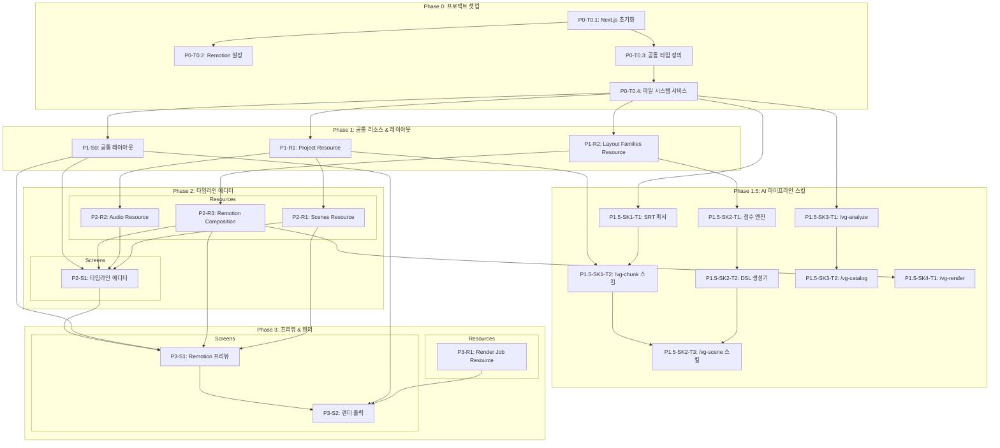

# newVideoGen - TASKS (Domain-Guarded v2.0)

> SRT 자막 + 더빙 오디오 → AI 프레젠테이션 영상 자동 생성
> "화면이 주도하되, 도메인이 방어한다"

## Interface Contract Validation

```
✅ PASSED - 모든 화면 data_requirements가 리소스 fields에 매핑됨

Resource        │ Screens Using    │ Coverage
────────────────┼──────────────────┼─────────
project         │ S1, S2, S3       │ 5/8 used
scenes          │ S1, S2, S3       │ 10/12 used
audio           │ S1, S2           │ 4/5 used
render_job      │ S3               │ 10/10 used
layout_families │ S1               │ 4/5 used
```

## 의존성 그래프



---

# Phase 0: 프로젝트 셋업

## P0-T0.1: Next.js + Tailwind + ShadCN 프로젝트 초기화

### [x] P0-T0.1: Next.js 프로젝트 생성
- **담당**: frontend-specialist
- **스펙**: Next.js 15 App Router + Tailwind CSS + ShadCN UI 프로젝트 생성
- **파일**:
  - `package.json`
  - `next.config.ts`
  - `tailwind.config.ts`
  - `src/app/layout.tsx`
  - `src/app/page.tsx`
- **설정**:
  - 다크 모드 기본 (bg: #000, accent: #00FF00)
  - Inter 폰트
  - TypeScript strict mode
  - src/ 디렉토리 구조

## P0-T0.2: Remotion 설정

### [x] P0-T0.2: Remotion 패키지 설치 및 설정
- **담당**: frontend-specialist
- **의존**: P0-T0.1
- **스펙**: Remotion + @remotion/player + @remotion/cli 설치, 기본 컴포지션 설정
- **파일**:
  - `src/remotion/Root.tsx` (루트 컴포지션)
  - `src/remotion/Composition.tsx` (기본 컴포지션)
  - `remotion.config.ts`
- **설정**:
  - compositionWidth: 1920
  - compositionHeight: 1080
  - fps: 30

## P0-T0.3: 공통 타입 정의

### [x] P0-T0.3: TypeScript 타입/인터페이스 정의
- **담당**: frontend-specialist
- **의존**: P0-T0.1
- **스펙**: `specs/shared/types.yaml` 기반 13개 타입을 TypeScript로 변환
- **파일**: `tests/types/types.test.ts` → `src/types/index.ts`
- **타입 목록**:
  - Project, ProjectStatus
  - Scene, LayoutFamily, CopyLayers, ChunkMetadata
  - SceneComponent, MotionConfig, AssetConfig
  - BeatMarker
  - RenderJob, RenderStatus, LogEntry, LogLevel
- **TDD**: RED → GREEN → REFACTOR

## P0-T0.4: 파일 시스템 서비스 레이어

### [x] P0-T0.4: JSON 파일 기반 CRUD 서비스
- **담당**: backend-specialist
- **의존**: P0-T0.3
- **스펙**: 프로젝트 데이터를 JSON 파일로 읽기/쓰기하는 기반 서비스
- **파일**: `tests/services/file-service.test.ts` → `src/services/file-service.ts`
- **기능**:
  - readJSON<T>(path): T
  - writeJSON<T>(path, data): void
  - listFiles(dir, pattern): string[]
  - ensureDir(path): void
- **데이터 경로**: `data/{projectId}/project.json`, `data/{projectId}/scenes.json`, ...
- **TDD**: RED → GREEN → REFACTOR

---

# Phase 1: 공통 리소스 & 레이아웃

## P1-R1: Project Resource

### [x] P1-R1-T1: Project API 구현
- **담당**: backend-specialist
- **리소스**: project
- **엔드포인트**:
  - GET /api/projects (목록)
  - GET /api/projects/:id (상세)
  - POST /api/projects (생성 - SRT + Audio 업로드)
  - PUT /api/projects/:id (수정)
- **필드**: id, name, srt_path, audio_path, created_at, updated_at, status, total_duration_ms
- **파일**: `tests/api/projects.test.ts` → `src/app/api/projects/route.ts`
- **스펙**: 파일 시스템 기반 프로젝트 CRUD (JSON 저장)
- **Worktree**: `worktree/phase-1-resources`
- **TDD**: RED → GREEN → REFACTOR
- **병렬**: P1-R2-T1과 병렬 가능

## P1-R2: Layout Families Resource

### [x] P1-R2-T1: Layout Families API 구현
- **담당**: backend-specialist
- **리소스**: layout_families
- **엔드포인트**:
  - GET /api/layout-families (8개 레이아웃 패밀리 카탈로그)
- **필드**: id, name, description, preview_svg, stack_variants
- **파일**: `tests/api/layout-families.test.ts` → `src/app/api/layout-families/route.ts`
- **스펙**: 8개 레이아웃 패밀리 정적 카탈로그 (hero-center, split-2col, grid-4x3, process-horizontal, radial-focus, stacked-vertical, comparison-bars, spotlight-case)
- **Worktree**: `worktree/phase-1-resources`
- **TDD**: RED → GREEN → REFACTOR
- **병렬**: P1-R1-T1과 병렬 가능

## P1-S0: 공통 레이아웃

### [x] P1-S0-T1: 공통 레이아웃 UI 구현
- **담당**: frontend-specialist
- **화면**: 전체 (AppShell)
- **컴포넌트**:
  - Header (navigation: 프로젝트명 + 뒤로가기/저장/설정)
  - MainSidebarLayout (70/30 분할)
  - FullWidthLayout (전체 너비)
- **데이터 요구**: project (data_requirements 참조)
- **파일**: `tests/components/Layout.test.tsx` → `src/components/layout/`
- **스펙**: 다크 테마 + 네온 그린 액센트 디자인 시스템, ShadCN 컴포넌트 활용
- **Worktree**: `worktree/phase-1-layout`
- **TDD**: RED → GREEN → REFACTOR
- **데모**: `/demo/phase-1/s0-layout`
- **데모 상태**: loading, normal

### [x] P1-S0-T2: 공통 레이아웃 테스트
- **담당**: test-specialist
- **화면**: 전체
- **시나리오**:
  | 이름 | When | Then |
  |------|------|------|
  | Header 렌더링 | 앱 로드 | 프로젝트명, 버튼 표시 |
  | 뒤로가기 | Back 클릭 | / 로 이동 |
  | 레이아웃 전환 | 라우트 변경 | main-sidebar ↔ full-width 전환 |
- **파일**: `tests/e2e/layout.spec.ts`
- **Worktree**: `worktree/phase-1-layout`

### [x] P1-S0-V: 공통 레이아웃 연결점 검증
- **담당**: test-specialist
- **검증 항목**:
  - [ ] Field Coverage: project.[id,name,status] 존재
  - [ ] Navigation: Header → / 라우트 존재
  - [ ] Theme: 다크 모드 (#000 bg, #00FF00 accent) 적용

---

# Phase 1.5: AI 파이프라인 스킬

> 핵심 AI 엔진: SRT 분석 → 의미 청킹 → 장면 DSL 생성 → 렌더링
> Claude Code Skills (.claude/skills/vg-*) + 점수 계산 엔진 + SRT 파서

## P1.5-SK1: /vg-chunk 스킬 (SRT → 의미 청킹)

### [x] P1.5-SK1-T1: SRT 파서 + 의미 분석 엔진
- **담당**: backend-specialist
- **스펙**: SRT 파일을 파싱하여 각 자막 구간의 의미를 분석하고 beats.json 생성
- **파일**: `tests/services/srt-parser.test.ts` → `src/services/srt-parser.ts`
- **기능**:
  - parseSRT(srtContent): SRTEntry[]
  - 시간 코드 → 프레임 번호 변환 (30fps)
  - 의미 분석 결과 타입 (intent, tone, evidenceType, emphasisTokens, density)
- **Worktree**: `worktree/phase-1.5-skills`
- **TDD**: RED → GREEN → REFACTOR
- **병렬**: P1.5-SK1-T2와 순차 (T1 먼저)

### [x] P1.5-SK1-T2: /vg-chunk Claude Code Skill 정의
- **담당**: backend-specialist
- **스펙**: `.claude/skills/vg-chunk/SKILL.md` 작성 + API Route 구현
- **파일**:
  - `.claude/skills/vg-chunk/SKILL.md` (스킬 정의)
  - `tests/api/skills-chunk.test.ts` → `src/app/api/skills/chunk/route.ts`
- **기능**:
  - POST /api/skills/chunk (SRT + Audio → beats.json)
  - Claude API 호출하여 의미 분석 (intent, tone, evidenceType 등)
  - 출력: `data/{projectId}/beats.json`
- **의존**: P1.5-SK1-T1, P1-R1-T1
- **Worktree**: `worktree/phase-1.5-skills`
- **TDD**: RED → GREEN → REFACTOR

## P1.5-SK2: /vg-scene 스킬 (비트 → 장면 DSL 생성)

### [x] P1.5-SK2-T1: 점수 계산 엔진 (Scoring Engine)
- **담당**: backend-specialist
- **스펙**: 레이아웃 선택을 위한 제약 기반 점수 계산 시스템
- **파일**: `tests/services/scoring-engine.test.ts` → `src/services/scoring-engine.ts`
- **점수 공식**:
  - 의미적합도(40) + 증거타입적합도(20) + 리듬적합도(15) + 자산보유(10)
  - 최근중복패널티(-25) - 직전유사도(-20)
- **의존**: P1-R2-T1 (레이아웃 카탈로그)
- **Worktree**: `worktree/phase-1.5-skills`
- **TDD**: RED → GREEN → REFACTOR
- **병렬**: P1.5-SK1-T1과 병렬 가능

### [x] P1.5-SK2-T2: DSL 생성기 (Scene DSL Generator)
- **담당**: backend-specialist
- **스펙**: 비트 + 점수 결과 → Scene DSL JSON 생성
- **파일**: `tests/services/dsl-generator.test.ts` → `src/services/dsl-generator.ts`
- **기능**:
  - generateSceneDSL(beat, layoutFamily, designTokens): SceneDSL
  - 컴포넌트 배치 (position, fontSize, animation)
  - 모션 프리셋 적용 (fadeUp, popNumber, staggerChildren 등)
  - Copy Layers 매핑 (kicker, headline, supporting, footer)
- **의존**: P1.5-SK2-T1
- **Worktree**: `worktree/phase-1.5-skills`
- **TDD**: RED → GREEN → REFACTOR

### [x] P1.5-SK2-T3: /vg-scene Claude Code Skill 정의
- **담당**: backend-specialist
- **스펙**: `.claude/skills/vg-scene/SKILL.md` 작성 + API Route 구현
- **파일**:
  - `.claude/skills/vg-scene/SKILL.md` (스킬 정의)
  - `tests/api/skills-scene.test.ts` → `src/app/api/skills/scene/route.ts`
- **기능**:
  - POST /api/skills/scene (beats.json + catalog → scene-plan.json + scene-*.json)
  - 점수 계산 → 레이아웃 선택 → DSL 생성 파이프라인
  - 출력: `data/{projectId}/scenes.json`, `data/{projectId}/scene-plan.json`
- **의존**: P1.5-SK2-T2, P1.5-SK1-T2
- **Worktree**: `worktree/phase-1.5-skills`
- **TDD**: RED → GREEN → REFACTOR

## P1.5-SK3: /vg-analyze + /vg-catalog 스킬 (기반, 1회성)

### [x] P1.5-SK3-T1: /vg-analyze 스킬 (레퍼런스 분석)
- **담당**: backend-specialist
- **스펙**: 레퍼런스 이미지 분석 → 디자인 토큰 + 레이아웃 패턴 추출
- **파일**:
  - `.claude/skills/vg-analyze/SKILL.md`
  - `tests/api/skills-analyze.test.ts` → `src/app/api/skills/analyze/route.ts`
- **기능**:
  - POST /api/skills/analyze (reference images → design-tokens.json, layout-exemplars.json)
  - 이미지 시각적 특징 추출, 디자인 토큰 (colors, typography, spacing, radii)
- **의존**: P0-T0.4
- **Worktree**: `worktree/phase-1.5-skills`
- **TDD**: RED → GREEN → REFACTOR
- **병렬**: P1.5-SK1-T1, P1.5-SK2-T1과 병렬 가능

### [x] P1.5-SK3-T2: /vg-catalog 스킬 (카탈로그 생성)
- **담당**: backend-specialist
- **스펙**: 레이아웃 카탈로그 + Scene DSL 스키마 + 모션 프리셋 카탈로그 생성
- **파일**:
  - `.claude/skills/vg-catalog/SKILL.md`
  - `tests/api/skills-catalog.test.ts` → `src/app/api/skills/catalog/route.ts`
- **기능**:
  - POST /api/skills/catalog (layout-exemplars + design-tokens → catalog.json)
  - 8개 레이아웃 패밀리별 추천 intent/tone 매핑
  - 10개 모션 프리셋 정의 (fadeUp, popNumber, staggerChildren 등)
- **의존**: P1.5-SK3-T1
- **Worktree**: `worktree/phase-1.5-skills`
- **TDD**: RED → GREEN → REFACTOR

## P1.5-SK4: /vg-render 스킬 (DSL → mp4)

### [x] P1.5-SK4-T1: /vg-render 스킬 (Remotion CLI 래핑)
- **담당**: backend-specialist
- **스펙**: Scene DSL → Remotion TSX 자동 생성 → mp4 렌더링
- **파일**:
  - `.claude/skills/vg-render/SKILL.md`
  - `tests/api/skills-render.test.ts` → `src/app/api/skills/render/route.ts`
  - `tests/services/remotion-builder.test.ts` → `src/services/remotion-builder.ts`
- **기능**:
  - POST /api/skills/render (scene DSL + audio → mp4)
  - Scene DSL → TSX 컴포넌트 자동 생성 (`src/generated/`)
  - `npx remotion render` CLI 실행
  - onProgress 콜백 → render_job 상태 파일 갱신
- **의존**: P2-R3-T1 (Remotion Composition 컴포넌트)
- **Worktree**: `worktree/phase-1.5-skills`
- **TDD**: RED → GREEN → REFACTOR

---

# Phase 2: 타임라인 에디터 (핵심)

## Resource 태스크

### P2-R1: Scenes Resource

#### [x] P2-R1-T1: Scenes API 구현
- **담당**: backend-specialist
- **리소스**: scenes
- **엔드포인트**:
  - GET /api/projects/:projectId/scenes (목록)
  - GET /api/projects/:projectId/scenes/:id (상세)
  - PUT /api/projects/:projectId/scenes/:id (수정 - DSL 편집)
  - POST /api/projects/:projectId/scenes/:id/split (장면 분할)
  - POST /api/projects/:projectId/scenes/merge (장면 병합)
  - DELETE /api/projects/:projectId/scenes/:id (삭제)
- **필드**: id, project_id, beat_index, layout_family, start_ms, end_ms, duration_frames, components, copy_layers, motion, assets, chunk_metadata
- **파일**: `tests/api/scenes.test.ts` → `src/app/api/projects/[projectId]/scenes/route.ts`
- **스펙**: 장면 DSL CRUD + 분할/병합 로직 (시간 재계산 포함)
- **Worktree**: `worktree/phase-2-resources`
- **TDD**: RED → GREEN → REFACTOR
- **병렬**: P2-R2-T1과 병렬 가능

### P2-R2: Audio Resource

#### [x] P2-R2-T1: Audio API 구현
- **담당**: backend-specialist
- **리소스**: audio
- **엔드포인트**:
  - GET /api/projects/:projectId/audio (파형 + 비트 마커)
  - GET /api/projects/:projectId/audio/waveform (파형 데이터만)
- **필드**: project_id, file_path, duration_ms, waveform_data, beat_markers
- **파일**: `tests/api/audio.test.ts` → `src/app/api/projects/[projectId]/audio/route.ts`
- **스펙**: 오디오 파형 샘플링 + SRT 기반 비트 마커 생성
- **Worktree**: `worktree/phase-2-resources`
- **TDD**: RED → GREEN → REFACTOR
- **병렬**: P2-R1-T1과 병렬 가능

### P2-R3: Remotion Composition 컴포넌트

#### [x] P2-R3-T1: 8개 레이아웃 패밀리 Remotion 컴포넌트
- **담당**: 3d-engine-specialist
- **스펙**: Scene DSL → TSX 렌더링을 위한 8개 레이아웃 패밀리 Remotion 컴포넌트
- **파일**: `tests/remotion/layouts.test.tsx` → `src/remotion/layouts/`
- **컴포넌트**:
  - HeroCenterLayout
  - Split2ColLayout
  - Grid4x3Layout
  - ProcessHorizontalLayout
  - RadialFocusLayout
  - StackedVerticalLayout
  - ComparisonBarsLayout
  - SpotlightCaseLayout
- **공통**:
  - CopyLayerRenderer (kicker, headline, supporting, footer)
  - MotionWrapper (entrance, emphasis, exit 애니메이션)
  - AssetRenderer (SVG 아이콘, 차트)
- **의존**: P1-R2-T1 (레이아웃 패밀리 카탈로그)
- **Worktree**: `worktree/phase-2-remotion`
- **TDD**: RED → GREEN → REFACTOR
- **병렬**: P2-R1-T1, P2-R2-T1과 병렬 가능

---

## Screen 태스크

### P2-S1: 타임라인 에디터 화면

> 화면: / (main-sidebar 레이아웃)
> 데이터 요구: project, scenes, audio, layout_families

#### [x] P2-S1-T1: 타임라인 에디터 UI 구현
- **담당**: frontend-specialist
- **화면**: /
- **컴포넌트**:
  - Header (navigation: 프로젝트명 + 저장)
  - TimelineViewport (list: 장면 카드 수평 스크롤)
  - SceneCard (card: 레이아웃 아이콘 + 시간 + 비트)
  - AudioWaveform (detail: 파형 + 비트 마커 + 플레이헤드)
  - DSLEditor (form: 레이아웃 선택 + JSON 편집)
  - FooterControls (navigation: 프리뷰/렌더 버튼)
- **데이터 요구**: project, scenes, audio, layout_families (data_requirements 참조)
- **파일**: `tests/pages/TimelineEditor.test.tsx` → `src/app/page.tsx`
- **스펙**: 좌측 70% 타임라인(장면 시퀀스 + 오디오 파형), 우측 30% DSL 에디터. 장면 선택/분할/병합/삭제. 키보드 단축키(←/→, Space, S)
- **Worktree**: `worktree/phase-2-timeline`
- **TDD**: RED → GREEN → REFACTOR
- **데모**: `/demo/phase-2/s1-timeline-editor`
- **데모 상태**: loading, error, empty, normal
- **의존**: P2-R1-T1, P2-R2-T1, P2-R3-T1, P1-S0-T1

#### [x] P2-S1-T2: 타임라인 에디터 통합 테스트
- **담당**: test-specialist
- **화면**: /
- **시나리오**:
  | 이름 | When | Then |
  |------|------|------|
  | 초기 로드 | 프로젝트 열기 | 장면 카드 시퀀스 표시, 파형 렌더링, 첫 장면 자동 선택 |
  | 장면 선택 | 장면 카드 클릭 | 네온 그린 링, DSL 에디터 업데이트 |
  | 구간 나누기 | Split 버튼 클릭 | 분할 모달 → 두 장면 생성 |
  | 레이아웃 변경 | 드롭다운 변경 | DSL layoutFamily 업데이트, 카드 미리보기 갱신 |
- **파일**: `tests/e2e/timeline-editor.spec.ts`
- **Worktree**: `worktree/phase-2-timeline`
- **의존**: P2-S1-T1

#### [x] P2-S1-V: 타임라인 에디터 연결점 검증
- **담당**: test-specialist
- **화면**: /
- **검증 항목**:
  - [ ] Field Coverage: project.[id,name,status,srt_path,audio_path] 존재
  - [ ] Field Coverage: scenes.[id,beat_index,layout_family,start_ms,end_ms,duration_frames,components,copy_layers] 존재
  - [ ] Field Coverage: audio.[file_path,duration_ms,waveform_data,beat_markers] 존재
  - [ ] Field Coverage: layout_families.[id,name,description,preview_svg] 존재
  - [ ] Endpoint: GET /api/projects/:id 응답 정상
  - [ ] Endpoint: GET /api/projects/:id/scenes 응답 정상
  - [ ] Endpoint: GET /api/projects/:id/audio 응답 정상
  - [ ] Endpoint: GET /api/layout-families 응답 정상
  - [ ] Navigation: FooterControls → /preview 라우트 존재
  - [ ] Navigation: FooterControls → /render 라우트 존재
- **파일**: `tests/integration/timeline-editor.verify.ts`
- **의존**: P2-S1-T1, P2-S1-T2

---

# Phase 3: 프리뷰 & 렌더

## Resource 태스크

### P3-R1: Render Job Resource

#### [x] P3-R1-T1: Render Job API 구현
- **담당**: backend-specialist
- **리소스**: render_job
- **엔드포인트**:
  - POST /api/projects/:projectId/render (렌더링 시작)
  - GET /api/projects/:projectId/render/:id (상태 조회)
  - PUT /api/projects/:projectId/render/:id/pause (일시 정지)
  - PUT /api/projects/:projectId/render/:id/cancel (취소)
- **필드**: id, project_id, status, total_frames, rendered_frames, started_at, completed_at, output_path, file_size, logs, current_scene
- **파일**: `tests/api/render.test.ts` → `src/app/api/projects/[projectId]/render/route.ts`
- **스펙**: Remotion CLI (npx remotion render) 래핑. onProgress 콜백 → 상태 파일 갱신. 500ms 폴링 지원
- **Worktree**: `worktree/phase-3-resources`
- **TDD**: RED → GREEN → REFACTOR

---

## Screen 태스크

### P3-S1: Remotion 프리뷰 화면

> 화면: /preview (full-width 레이아웃)
> 데이터 요구: project, scenes, audio

#### [x] P3-S1-T1: Remotion 프리뷰 UI 구현
- **담당**: frontend-specialist
- **화면**: /preview
- **컴포넌트**:
  - PreviewHeader (navigation: 뒤로가기 + 전체화면)
  - RemotionPlayer (detail: 1920x1080 Player 실시간 렌더링)
  - PlaybackControls (form: 재생/정지/탐색 + 속도 + 음량)
  - SceneNavigation (navigation: 이전/다음 장면 + 현재 장면 표시)
- **데이터 요구**: project, scenes, audio (data_requirements 참조)
- **파일**: `tests/pages/RemotionPreview.test.tsx` → `src/app/preview/page.tsx`
- **스펙**: Remotion Player로 장면 DSL 실시간 렌더링. 오디오 싱크 (<Audio> 컴포넌트). 재생 속도 0.5x~2x. 장면 간 네비게이션
- **Worktree**: `worktree/phase-3-preview`
- **TDD**: RED → GREEN → REFACTOR
- **데모**: `/demo/phase-3/s1-remotion-preview`
- **데모 상태**: loading, error, normal
- **의존**: P2-R3-T1, P2-R1-T1, P1-S0-T1

#### [x] P3-S1-T2: Remotion 프리뷰 통합 테스트
- **담당**: test-specialist
- **화면**: /preview
- **시나리오**:
  | 이름 | When | Then |
  |------|------|------|
  | 초기 로드 | /preview 접속 | 첫 장면 렌더링, 정지 상태, 장면 1/N 표시 |
  | 재생 | 재생 버튼 클릭 | 영상 재생, 슬라이더 이동, 장면 네비 자동 업데이트 |
  | 장면 이동 | 다음 장면 클릭 | 다음 장면 시작 프레임 점프 |
- **파일**: `tests/e2e/remotion-preview.spec.ts`
- **Worktree**: `worktree/phase-3-preview`
- **의존**: P3-S1-T1

#### [x] P3-S1-V: Remotion 프리뷰 연결점 검증
- **담당**: test-specialist
- **화면**: /preview
- **검증 항목**:
  - [ ] Field Coverage: scenes.[id,beat_index,layout_family,start_ms,end_ms,duration_frames,components,copy_layers,motion,assets] 존재
  - [ ] Field Coverage: audio.[file_path,duration_ms] 존재
  - [ ] Endpoint: GET /api/projects/:id/scenes 응답 정상
  - [ ] Navigation: PreviewHeader → / 라우트 존재
  - [ ] Remotion: Player compositionWidth=1920, compositionHeight=1080, fps=30
- **파일**: `tests/integration/remotion-preview.verify.ts`
- **의존**: P3-S1-T1, P3-S1-T2

### P3-S2: 렌더 출력 화면

> 화면: /render (full-width 레이아웃)
> 데이터 요구: project, render_job, scenes

#### [x] P3-S2-T1: 렌더 출력 UI 구현
- **담당**: frontend-specialist
- **화면**: /render
- **컴포넌트**:
  - RenderHeader (navigation: 뒤로가기 + 상태 표시)
  - RenderProgress (detail: 진행률 바 + 프레임 카운트 + 예상 시간 + 일시정지/취소)
  - RenderLog (list: 실시간 로그 자동 스크롤)
  - DownloadPanel (detail: mp4 다운로드 + 폴더 열기)
- **데이터 요구**: project, render_job, scenes (data_requirements 참조)
- **파일**: `tests/pages/RenderOutput.test.tsx` → `src/app/render/page.tsx`
- **스펙**: 렌더링 진행률 실시간 표시 (500ms 폴링). 로그 자동 스크롤. 완료 시 다운로드 패널 표시. 일시정지/취소 지원
- **Worktree**: `worktree/phase-3-render`
- **TDD**: RED → GREEN → REFACTOR
- **데모**: `/demo/phase-3/s2-render-output`
- **데모 상태**: loading, rendering, completed, failed
- **의존**: P3-R1-T1, P1-S0-T1

#### [x] P3-S2-T2: 렌더 출력 통합 테스트
- **담당**: test-specialist
- **화면**: /render
- **시나리오**:
  | 이름 | When | Then |
  |------|------|------|
  | 렌더링 시작 | /render 접속 | 진행률 0%, 로그 "렌더링 시작", 일시정지/취소 활성 |
  | 렌더링 진행 | 렌더링 중 | 진행률 실시간 갱신, 현재 장면 ID 표시, 로그 갱신 |
  | 렌더링 완료 | 완료 | 100% 표시, 다운로드 패널(파일명+크기), 버튼 활성 |
  | 렌더링 취소 | 취소 클릭 | 확인 다이얼로그, 확인 시 중단 + 타임라인 이동 |
- **파일**: `tests/e2e/render-output.spec.ts`
- **Worktree**: `worktree/phase-3-render`
- **의존**: P3-S2-T1

#### [x] P3-S2-V: 렌더 출력 연결점 검증
- **담당**: test-specialist
- **화면**: /render
- **검증 항목**:
  - [ ] Field Coverage: render_job.[id,status,total_frames,rendered_frames,started_at,completed_at,output_path,file_size,logs,current_scene] 존재
  - [ ] Field Coverage: scenes.[id,beat_index,layout_family] 존재
  - [ ] Endpoint: POST /api/projects/:id/render 응답 정상
  - [ ] Endpoint: GET /api/projects/:id/render/:id 응답 정상
  - [ ] Navigation: RenderHeader → / 라우트 존재
  - [ ] Polling: 500ms 간격 상태 갱신
- **파일**: `tests/integration/render-output.verify.ts`
- **의존**: P3-S2-T1, P3-S2-T2

---

# 태스크 요약

| Phase | ID | 태스크 | 담당 | 의존 |
|-------|-----|--------|------|------|
| P0 | P0-T0.1 | Next.js 프로젝트 초기화 | frontend-specialist | - |
| P0 | P0-T0.2 | Remotion 설정 | frontend-specialist | P0-T0.1 |
| P0 | P0-T0.3 | 공통 타입 정의 | frontend-specialist | P0-T0.1 |
| P0 | P0-T0.4 | 파일 시스템 서비스 | backend-specialist | P0-T0.3 |
| P1 | P1-R1-T1 | Project API | backend-specialist | P0-T0.4 |
| P1 | P1-R2-T1 | Layout Families API | backend-specialist | P0-T0.4 |
| P1 | P1-S0-T1 | 공통 레이아웃 UI | frontend-specialist | P0-T0.4 |
| P1 | P1-S0-T2 | 공통 레이아웃 테스트 | test-specialist | P1-S0-T1 |
| P1 | P1-S0-V | 공통 레이아웃 검증 | test-specialist | P1-S0-T2 |
| P1.5 | P1.5-SK1-T1 | SRT 파서 + 의미 분석 엔진 | backend-specialist | P0-T0.4 |
| P1.5 | P1.5-SK1-T2 | /vg-chunk 스킬 정의 | backend-specialist | P1.5-SK1-T1, P1-R1-T1 |
| P1.5 | P1.5-SK2-T1 | 점수 계산 엔진 | backend-specialist | P1-R2-T1 |
| P1.5 | P1.5-SK2-T2 | DSL 생성기 | backend-specialist | P1.5-SK2-T1 |
| P1.5 | P1.5-SK2-T3 | /vg-scene 스킬 정의 | backend-specialist | P1.5-SK2-T2, P1.5-SK1-T2 |
| P1.5 | P1.5-SK3-T1 | /vg-analyze 스킬 | backend-specialist | P0-T0.4 |
| P1.5 | P1.5-SK3-T2 | /vg-catalog 스킬 | backend-specialist | P1.5-SK3-T1 |
| P1.5 | P1.5-SK4-T1 | /vg-render 스킬 | backend-specialist | P2-R3-T1 |
| P2 | P2-R1-T1 | Scenes API | backend-specialist | P1-R1-T1 |
| P2 | P2-R2-T1 | Audio API | backend-specialist | P1-R1-T1 |
| P2 | P2-R3-T1 | Remotion Composition | 3d-engine-specialist | P1-R2-T1 |
| P2 | P2-S1-T1 | 타임라인 에디터 UI | frontend-specialist | P2-R1-T1, P2-R2-T1, P2-R3-T1, P1-S0-T1 |
| P2 | P2-S1-T2 | 타임라인 에디터 테스트 | test-specialist | P2-S1-T1 |
| P2 | P2-S1-V | 타임라인 에디터 검증 | test-specialist | P2-S1-T1, P2-S1-T2 |
| P3 | P3-R1-T1 | Render Job API | backend-specialist | P0-T0.4 |
| P3 | P3-S1-T1 | Remotion 프리뷰 UI | frontend-specialist | P2-R3-T1, P2-R1-T1, P1-S0-T1 |
| P3 | P3-S1-T2 | Remotion 프리뷰 테스트 | test-specialist | P3-S1-T1 |
| P3 | P3-S1-V | Remotion 프리뷰 검증 | test-specialist | P3-S1-T1, P3-S1-T2 |
| P3 | P3-S2-T1 | 렌더 출력 UI | frontend-specialist | P3-R1-T1, P1-S0-T1 |
| P3 | P3-S2-T2 | 렌더 출력 테스트 | test-specialist | P3-S2-T1 |
| P3 | P3-S2-V | 렌더 출력 검증 | test-specialist | P3-S2-T1, P3-S2-T2 |

**총 30개 태스크** (P0: 4, P1: 5, P1.5: 8, P2: 6, P3: 7)

## 병렬 실행 그룹

| Phase | 병렬 그룹 | 태스크 |
|-------|-----------|--------|
| P0 | Setup | P0-T0.2, P0-T0.3 (P0-T0.1 후 병렬) |
| P1 | Resources | P1-R1-T1, P1-R2-T1 (병렬) |
| P1 | Layout | P1-S0-T1 (Resources와 병렬) |
| P1.5 | Skills-A | P1.5-SK1-T1, P1.5-SK2-T1, P1.5-SK3-T1 (병렬, P1 완료 후) |
| P1.5 | Skills-B | P1.5-SK1-T2, P1.5-SK2-T2, P1.5-SK3-T2 (각 A 완료 후) |
| P1.5 | Skills-C | P1.5-SK2-T3 (SK1-T2, SK2-T2 완료 후) |
| P1.5 | Skills-D | P1.5-SK4-T1 (P2-R3-T1 완료 후) |
| P2 | Resources | P2-R1-T1, P2-R2-T1, P2-R3-T1 (병렬) |
| P3 | Resources | P3-R1-T1 (P2 Resources와 병렬 가능) |
| P3 | Screens | P3-S1-T1, P3-S2-T1 (서로 다른 화면이므로 병렬 가능) |
